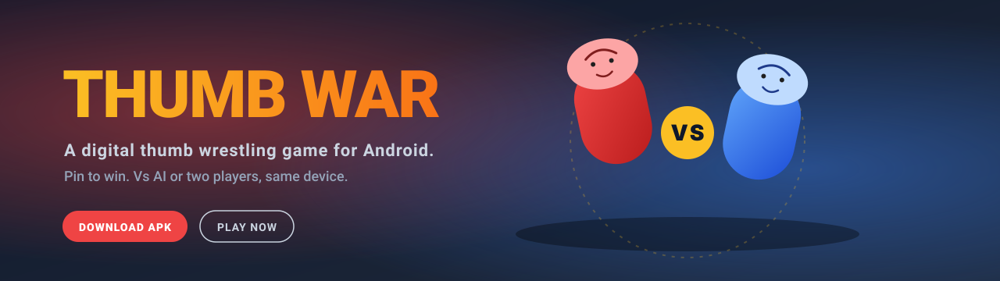

<div align="center">

[](https://highviewone.github.io/ThumbWar/)

# Thumb War

**A digital thumb wrestling game for Android.** Pin your opponent's thumb and hold it for 2.5 seconds to win.

[](https://github.com/HighviewOne/ThumbWar/actions/workflows/ci-cd.yml)
[](https://app.codecov.io/gh/HighviewOne/ThumbWar)
[](https://github.com/HighviewOne/ThumbWar/releases/latest)
[](https://github.com/HighviewOne/ThumbWar/releases)
[](#)
[](#)
[](#license)

### [⬇ Download APK](https://github.com/HighviewOne/ThumbWar/releases/latest/download/app-release.apk) · [🎮 Website](https://highviewone.github.io/ThumbWar/) · [📖 Docs](#documentation)

</div>

> Requires Android 8.0 or higher. Enable "Install from unknown sources" in device settings to install.

---

## Features

| | |
|---|---|
| 🤖 **VS Computer** | Three AI difficulties — Easy, Medium, Hard |
| 👥 **Two Players** | Same device, landscape mode, one thumb each |
| 🎬 **Countdown** | "1, 2, 3, 4, I declare a thumb war!" |
| 🏆 **Best of 3** | Choose single round or best-of-3 before each game |
| 🎯 **Pin Mechanics** | Overlap and hold for 2.5s; ring fills yellow → red |
| 🔊 **Sound & Haptics** | Toggleable audio and vibration feedback |
| 📊 **Stats Tracking** | Wins, losses, and streaks persisted across sessions |
| ⚙️ **Settings** | Sound, vibration, default difficulty |

## How to Play

1. **Touch** the screen to control your thumb
2. **Chase** your opponent and overlap their thumb
3. **Hold the pin** — a progress ring fills from yellow to red
4. **Win** when the ring completes (the pinned player can escape by dragging away)

## Documentation

- [Architecture Overview](ARCHITECTURE.md) — Project structure, design patterns, components
- [Game Mechanics](GAME_MECHANICS.md) — Rules, physics, AI behavior
- [Contributing Guide](CONTRIBUTING.md) — Development setup, code style, PR process
- [Accessibility](ACCESSIBILITY.md) — Accessibility support and usage
- [API Reference](https://github.com/HighviewOne/ThumbWar/wiki) — Generated KDoc

## Building from Source

**Prerequisites:** JDK 17+, Android SDK (API 34 recommended), Git

```bash
git clone https://github.com/HighviewOne/ThumbWar.git
cd ThumbWar
cp local.properties.template local.properties
./gradlew assembleDebug
```

Output: `app/build/outputs/apk/debug/app-debug.apk`

See [CONTRIBUTING.md](CONTRIBUTING.md) for the full development setup.

## Code Quality

- **Detekt** — Kotlin linting and static analysis
- **ktlint** — Code formatting and style
- **Unit Tests** — 70%+ coverage
- **Instrumentation Tests** — UI and integration
- **ProGuard** — Release-build obfuscation
- **CI/CD** — Automated testing and building via GitHub Actions

```bash
./gradlew detekt ktlintCheck testDebugUnitTest jacocoTestReport
```

## Tech Stack

- **Language** — Kotlin
- **UI** — Jetpack Compose (Material3)
- **State** — Coroutines + StateFlow
- **Persistence** — DataStore Preferences
- **Rendering** — Canvas API (procedural, no bitmap assets)
- **Game Loop** — Coroutine-based, ~60fps
- **Testing** — JUnit 4, MockK, Compose Testing, Espresso
- **Build** — Gradle 8.5 with Kotlin DSL

## Project Structure

```
app/src/main/java/com/thumbwar/
├── engine/      — Game loop, collision detection, phases
├── ui/          — Jetpack Compose screens and components
├── input/       — Touch input handling
├── ai/          — AI opponent logic
├── audio/       — Sound and vibration
├── data/        — Repositories and persistence
└── util/        — Math and utilities
```

See [ARCHITECTURE.md](ARCHITECTURE.md) for the detailed breakdown.

## Contributing

Contributions welcome! See [CONTRIBUTING.md](CONTRIBUTING.md) for setup, code style, and the PR process.

## License

MIT License — free to use and modify.

---

<div align="center">
<sub>Built with Kotlin & Jetpack Compose.</sub>
</div>
